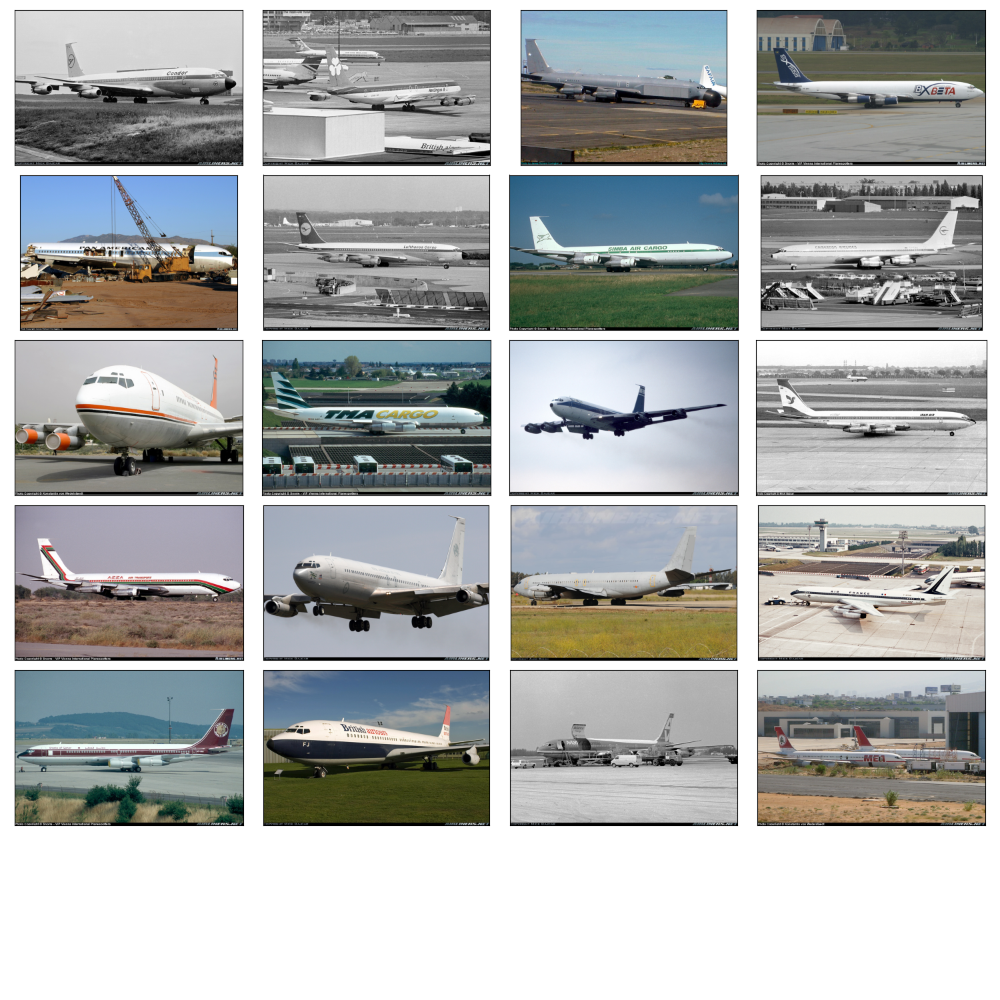
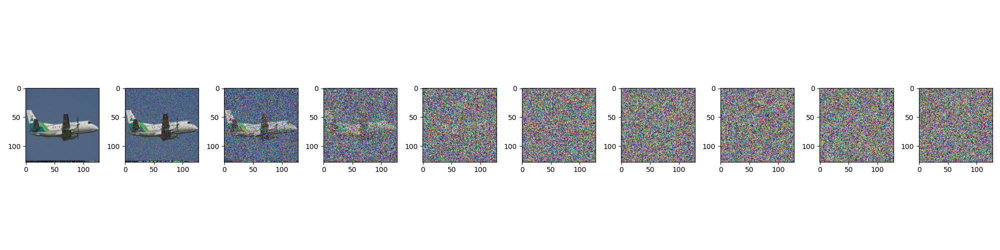

# Project Documentation: Training a UNET-based Diffusion Model on FGVC Aircraft Dataset

## 1. Introduction

The objective of this project is to develop and train a UNET-based diffusion model on the Fine-Grained Visual Categorization of Aircraft (FGVC Aircraft) dataset. The primary focus is to demonstrate the model's ability to effectively learn the data distribution and generate high-quality images. This project explores the applications of diffusion models in tasks such as image denoising and image generation.

## 2. Dataset Description

## FGVC Aircraft Dataset

The FGVC Aircraft dataset is a comprehensive dataset used for fine-grained visual categorization, containing 10,000 images of aircraft across 100 different aircraft model variants. Each image is annotated with the aircraft model variant, family, and manufacturer. The dataset provides a challenging benchmark due to the fine-grained nature of the categories and the variations in aircraft poses, lighting conditions, and backgrounds.

- **Number of Images:** 10,000
- **Categories:** 100 different aircraft model variants
- **Annotations:** Model variant, family, manufacturer

||
|:--:|
| *Sample Images from the FGVC Aircraft Dataset* |

## 3. Data Preprocessing

### 3.1 Image Normalization

All images are resized to a consistent size (e.g., 128x128 pixels) to maintain uniformity in training. The pixel values are normalized to the range [0, 1] for efficient training and better convergence.

### 3.2 Noise Generator and Forward Diffusion Process Explanation

#### 1. Linear Beta Scheduler

The `linear_beta_scheduler` function generates a sequence of beta values linearly spaced between `start` and `end` over a given number of timesteps, `T`. These betas, denoted as $\beta_t$, control the variance added at each step of the diffusion process.

#### 2. Coefficients Computation

- **Betas** ($\beta_t$) : A sequence of values controlling the noise level added at each timestep.
- **Alphas** ($\alpha_t$) : Defined as $1 - \beta_t$, representing the retention of the original signal at each timestep.
- **Cumulative Products**:
  - $\alpha_t^{\text{cumprod}} = \prod_{i=1}^{t} \alpha_i$ : Cumulative product of alphas up to timestep $t$.
  - $\alpha_{t-1}^{\text{cumprod}} = \prod_{i=1}^{t-1} \alpha_i$ : Cumulative product of alphas up to timestep $t-1$.
- **Square Root Coefficients**:
  - $\sqrt{\text{recip}_\alpha} = \sqrt{\frac{1}{\alpha_t}}$ : Inverse square root of alphas.
  - $\sqrt{\alpha_t^{\text{cumprod}}} = \sqrt{\alpha_t^{\text{cumprod}}}$ : Square root of cumulative product of alphas.
  - $\sqrt{1 - \alpha_t^{\text{cumprod}}} = \sqrt{1 - \alpha_t^{\text{cumprod}}}$ : Square root of one minus the cumulative product of alphas.

#### 3. Noise Sampling and Forward Diffusion

The function `forward_diffusion_sample` generates a noisy version of the input $x_0$ using the following equations:

**Input:**

- $x_0$ : The original data (clean sample).
- $t$ : Timestep at which to sample the noise.
- `device` : The device to perform computations on (CPU or GPU).

**Steps:**

1. **Noise Generation** :
   - $noise \sim \mathcal{N}(0, 1)$ : Gaussian noise sampled with the same shape as $x_0$.

2. **Mean and Variance Calculation** :
   - $mean\_coeff = \sqrt{\alpha_t^{\text{cumprod}}}$ and $var\_coeff = \sqrt{1 - \alpha_t^{\text{cumprod}}}$
   - $mean = mean\_coeff \cdot x_0$: Scaled version of the original data.
   - $var = var\_coeff \cdot noise$: Scaled noise.

3. **Noisy Sample Generation**:
   - $x_t = mean + var$ : The resulting noisy sample $x_t$ at timestep $t$ is the sum of the scaled original data and the scaled noise.

The process progressively adds noise to the data $x_0$ over $T$ timesteps, each step introducing noise controlled by the betas. The forward diffusion process aims to transform the data into pure noise as $t$ approaches $T$.

|  |
|:--:|
| *Forward Diffusion Process: Adding Noise to the Data* |

## 5. Training Intuition

## 4. Model Architecture - UNET-based Diffusion Model

The UNET model is a fully convolutional neural network designed for tasks that require precise localization, such as image segmentation and denoising. The architecture consists of two main parts: the **encoder** (or contracting path) and the **decoder** (or expansive path), which are connected by a bottleneck layer. The key feature of UNET is the use of **skip connections** that link corresponding layers of the encoder and decoder, allowing the model to retain fine details in the input images.

### 1. **Encoder (Contracting Path)**

The encoder path is responsible for capturing the context and features of the input image. It consists of a series of **EncoderBlocks**, each containing two convolutional layers followed by a batch normalization and ReLU activation. The main steps involved are:

- **Convolutional Layers:** Each block starts with a convolutional layer that reduces the spatial dimensions of the input but increases the number of feature maps. The kernel size is 3x3, and padding is set to 1 to preserve the spatial dimensions after convolution.
- **Batch Normalization:** This layer normalizes the feature maps to speed up training and improve model stability.
- **ReLU Activation:** This introduces non-linearity into the model, allowing it to learn complex patterns.
- **Pooling Layer:** After each EncoderBlock, a MaxPooling layer with a kernel size of 2x2 and stride of 2 is applied. This reduces the spatial dimensions by half and helps the model focus on the most prominent features.

The encoder progressively downsamples the input image, capturing increasingly abstract features while reducing the spatial resolution.

### 2. **Bottleneck Layer**

The bottleneck serves as a bridge between the encoder and decoder paths. It is a critical part of the network where the most compressed and abstract features are captured. The bottleneck also consists of an EncoderBlock, similar to those in the encoder, but with a larger number of feature maps. This allows the network to learn a rich set of features from the input data.

### 3. **Decoder (Expansive Path)**

The decoder path is responsible for reconstructing the image from the features captured by the encoder, up to the original image dimensions. It mirrors the encoder structure and consists of the following components:

- **UpConvolution (Transposed Convolution):** Each decoder step starts with an upsampling operation using a transposed convolution (also known as deconvolution). This operation doubles the spatial dimensions of the feature maps.
- **Concatenation (Skip Connections):** The output of the upsampling step is concatenated with the corresponding feature maps from the encoder (via skip connections). This concatenation helps the decoder to retain fine details and spatial information from the encoder, which might have been lost during downsampling.
- **DecoderBlock:** After concatenation, a DecoderBlock similar to the EncoderBlock is applied. This block further refines the features and reduces the number of feature maps while maintaining the increased spatial dimensions.

The decoder progressively upsamples the feature maps, reconstructing the fine details and spatial resolution lost during encoding.

### 4. **Final Convolution Layer**

The final layer of the UNET model is a 1x1 convolutional layer that maps the feature maps produced by the last DecoderBlock to the desired number of output channels (e.g., 3 for RGB images). This layer outputs the final prediction, which could be a denoised image, a segmentation map, or any other form of output depending on the task.

### 5. **Weight Initialization**

To ensure stable training, the weights of the convolutional layers are initialized using Kaiming normal initialization, which is suitable for layers with ReLU activations. Batch normalization layers have their weights set to 1 and biases to 0, ensuring no initial scaling or shifting of the normalized output.

||
|:--:|
| *Image Source: Ronneberger et al., 2015* |

## 5. Training the Model

## 5.1 Loss Function

The training involves optimizing a loss function that measures the difference between the denoised output and the original image. The mean squared error (MSE) is commonly used for this purpose. The MSE loss is defined as:

$$
\text{MSE} = \frac{1}{mn} \sum_{i=1}^{m} \sum_{j=1}^{n} \left[I(i,j) - K(i,j)\right]^2
$$

Here, $I(i,j)$ and $K(i,j)$ are the pixel values of the original and reconstructed images, respectively, and $m$ and $n$ are the dimensions of the images.

## 5.2 Optimization

The model is trained using an optimization algorithm, typically Adam, with a learning rate schedule that reduces the learning rate as training progresses.

- **Optimizer:** Adam
- **Initial Learning Rate:** 0.001
- **Decay Rate:** 0.1
- **Learning Rate Schedule:** Exponential Decay

$$\text{Exponential Decay Algorithm:} \space lr = lr_{\text{initial}} \times \exp(-\text{decay} \times \text{epoch})$$

## 5.3 Training Hardware

Training a UNET-based diffusion model on a large dataset like FGVC Aircraft requires substantial computational resources. The project utilizes the following hardware configuration deployed from [Lambda Labs](https://lambdalabs.com/):

- NVIDIA A100 GPU with 40GB VRAM
- 128GB RAM
- 64 CPU Cores

## 6. Results and Analysis

## 6.1 Evaluation Metrics

The model's performance is evaluated using the following metrics:

### Peak Signal-to-Noise Ratio (PSNR)

PSNR is a widely used metric to measure the quality of reconstructed images compared to their ground truth counterparts. It is particularly useful in assessing the performance of image denoising models. The PSNR metric is defined as:

$$\text{PSNR} = 10 \cdot \log_{10} \left(\frac{L^2}{\text{MSE}}\right)$$

where:

- $L$ is the maximum possible pixel value of the image. For images with 8-bit per channel, $L = 255$.
- $\text{MSE}$ is the Mean Squared Error between the original and reconstructed images

Higher PSNR values indicate better image reconstruction quality, with less distortion or noise introduced during the process.

### Structural Similarity Index (SSIM)

SSIM is a perceptual metric that quantifies the similarity between two images, considering changes in structural information, luminance, and contrast. It is designed to model the human visual perception of image quality and is more consistent with human judgment compared to PSNR. SSIM is computed as:

$$
\text{SSIM}(x, y) = \frac{(2\mu_x \mu_y + C_1)(2\sigma_{xy} + C_2)}{(\mu_x^2 + \mu_y^2 + C_1)(\sigma_x^2 + \sigma_y^2 + C_2)}
$$

where:

- $\mu_x$ and $\mu_y$ are the mean pixel values of images $x$ and $y$, respectively.
- $\sigma_x^2$ and $\sigma_y^2$ are the variances of the pixel values of $x$ and $y$.
- $\sigma_{xy}$ is the covariance of the pixel values between $x$ and $y$.
- $C_1$ and $C_2$ are small constants to stabilize the division when the denominator is close to zero, typically set as $C_1 = (K_1 L)^2$ and $C_2 = (K_2 L)^2$, with $K_1 = 0.01$ and $K_2 = 0.03$.

SSIM values range from -1 to 1, where 1 indicates perfect similarity between the original and reconstructed images. This metric is particularly sensitive to structural distortions, making it a valuable tool for evaluating models that aim to preserve image structure and details.

## 6.2 Result Plots

The results include a comparison of the original, noisy, and denoised images. Plots illustrating the training loss and validation loss over epochs are also provided.

**Original, Noisy, and Denoised Images:**

- **Figure 1:** Original image
- **Figure 2:** Noisy image
- **Figure 3:** Denoised image (model output)

**Loss Curves:**

- **Figure 4:** Training and validation loss over epochs

## 7. References

- [FGVC Aircraft Dataset](https://www.robots.ox.ac.uk/~vgg/data/fgvc-aircraft/)
- [UNet: Convolutional Networks for Biomedical Image Segmentation, Ronneberger et al., 2015](https://arxiv.org/abs/1505.04597)
- [Torchvision Datasets](https://pytorch.org/vision/stable/datasets.html)
- [Peak Signal-to-Noise Ratio (PSNR)](https://en.wikipedia.org/wiki/Peak_signal-to-noise_ratio)
- [Structural Similarity Index (SSIM)](https://en.wikipedia.org/wiki/Structural_similarity)
- [Adam Optimizer](https://arxiv.org/abs/1412.6980)
- [Kaiming Initialization](https://arxiv.org/abs/1502.01852)
- [Batch Normalization](https://arxiv.org/abs/1502.03167)
- [PyTorch Documentation](https://pytorch.org/docs/stable/index.html)
- [Lambda Labs](https://lambdalabs.com/)